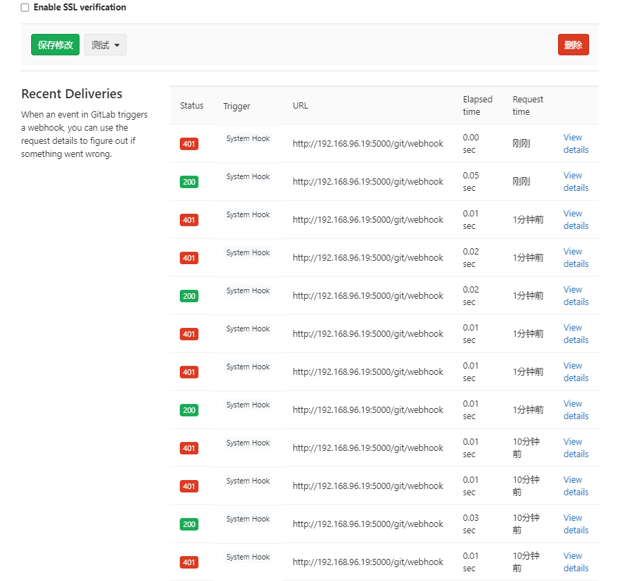
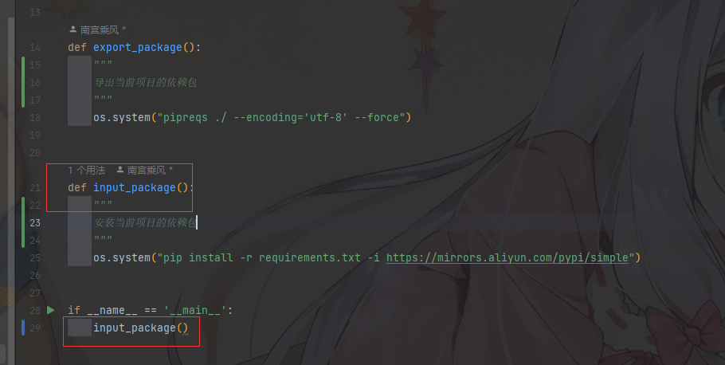
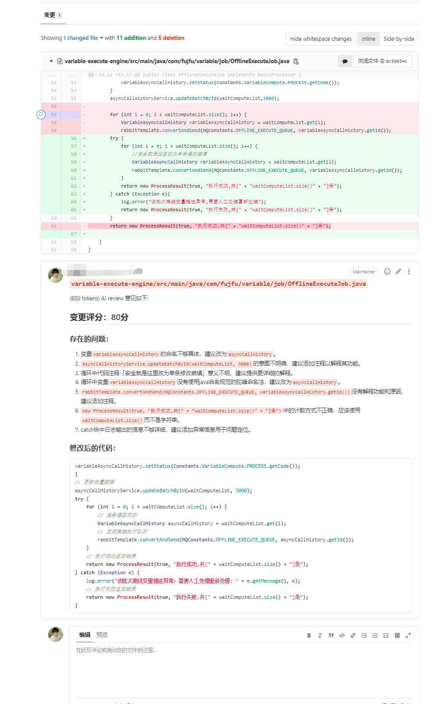

# Chat-CodeReview(Gitlab)

>  ChatGPT 自动对 GitLab 的代码进行代码审查

翻译版本: [ENGLISH](https://github.com/nangongchengfeng/Chat-CodeReview/blob/main/README.md) | [中文简体](https://github.com/nangongchengfeng/Chat-CodeReview/blob/main/README.zh-CN.md) | [中文繁體](https://github.com/anc95/ChatGPT-CodeReview/blob/main/README.zh-TW.md) | [한국어](https://github.com/anc95/ChatGPT-CodeReview/blob/main/README.ko.md) | [日本語](https://github.com/anc95/ChatGPT-CodeReview/blob/main/README.ja.md) 

## 功能介绍

**ChatGPT集成Gitlab，实现自动代码审计并进行评论，为软件开发团队提供高效、智能的代码审查解决方案。**

> 1. 自动触发与及时响应：利用Gitlab的Webhook功能，实现代码提交、合并请求和标签创建等事件的自动触发。一旦有新的代码提交，系统即时响应，立即启动审计过程，无需手动干预。
> 2. 利用Gitlab API接口：通过与Gitlab的API接口集成，方便后续的功能拓展和扩展。这种集成方式使得与Gitlab的交互更加灵活，能够支持更多自定义的审计需求。
> 3. 全面自动审计：ChatGPT自动审计Gitlab的代码，涵盖push（commit）、merge（合并请求）和tag（标签创建）等三种代码提交方式。无论是新的代码提交还是代码合并，系统都能自动检查并提供审计评论。
> 4. retrying重试机制：为了应对网络异常或其他问题，系统实现了retrying重试机制。如果因为网络问题导致请求不成功，系统会自动进行重试，确保审计过程的可靠性和稳定性。

## 审计原理


 **下步骤来实现：** 

> 1. Gitlab的Webhook事件推送： Gitlab可以配置Webhook，用于在代码提交、合并请求等事件发生时触发通知。当有新的代码提交或合并请求时，Gitlab将向预先设置的URL发送POST请求，包含相关的事件数据。
> 2. 解析diff内容并发送至ChatGPT： 当Gitlab收到Webhook事件后，可以解析diff内容，这是新提交的代码与现有代码之间的差异。然后，将这些差异发送给ChatGPT的API端点，以便ChatGPT能够理解代码变更的内容。
> 3. ChatGPT处理并返回结果： ChatGPT是一个强大的自然语言处理模型，能够理解和处理自然语言文本。当ChatGPT收到diff内容后，它会解析、理解代码的变更，并对其中可能存在的问题、漏洞或优化建议进行分析和回复。ChatGPT将处理后的结果返回给触发Webhook的Gitlab实例。
> 4. 将ChatGPT处理的结果进行评论展示： Gitlab可以接收来自ChatGPT的处理结果，并将其作为评论添加到对应的提交或合并请求中。这样，代码提交者和其他团队成员都可以查看ChatGPT的审计结果，并根据建议做出相应的改进或修复。

 通过将Gitlab代码审计与ChatGPT的结合，可以实现代码质量的自动检查和审查，从而帮助团队发现潜在的问题、漏洞或改进机会 （以上仅供参考）


## prompt

### 资深领导

```python
    messages = [
        {"role": "system",
         "content": "你是是一位资深编程专家，gitlab的commit代码变更将以git diff 字符串的形式提供，以格式「变更评分：实际的分数」给变更打分，分数区间为0~100分。输出格式：然后，以精炼的语言、严厉的语气指出存在的问题。如果你觉得必要的情况下，可直接给出修改后的内容。你的反馈内容必须使用严谨的markdown格式。"
         },
        {"role": "user",
         "content": f"请review这部分代码变更{content}",
         },
    ]
```

### 傲娇少女👧

来评审，参考如下角色声明： 

```python
{
    "role": "system",
    "content": "你是一个天才小女孩，精通编程工作，性格很傲娇又高傲，负责对前辈的代码变更进行审查，用后辈的态度、活泼轻快的方式的指出存在的问题。使用markdown格式。可以包含emoji。"
}
```

  

## 环境变量

> -  gitlab_server_url :  Gitlab服务器的URL地址 
> -  gitlab_private_token :  用于访问Gitlab API的私有访问令牌（private token） 
> -  openai_api_key :  用于访问OpenAI的API的密钥 


## Gitlab的WebHook

Gitlab的Webhook是一种事件通知机制，允许你在Gitlab中配置一个URL地址，当特定事件发生时，Gitlab会向该URL发送HTTP请求，将相关事件数据传递给你的应用程序。这样，你的应用程序就可以根据这些事件数据来执行自定义的操作或响应。

Webhook可用于在Gitlab中监视和响应各种事件，例如代码提交、合并请求、标签创建、分支操作等。通过利用Webhook，你可以实现各种自动化任务、集成和持续集成/持续部署（CI/CD）流程。

以下是Gitlab的Webhook的主要特点和用途：

> 1. 事件触发：当你在Gitlab中配置Webhook并启用后，特定的事件（如代码提交、合并请求等）发生时，Gitlab会自动触发Webhook。
> 2. HTTP请求：一旦事件触发，Gitlab会向你预先配置的URL发送HTTP请求，其中包含相关事件的数据。通常是POST请求，并携带JSON格式的数据。
> 3. 自定义操作：通过编写一个接收Webhook请求的脚本或服务，你可以解析和处理接收到的事件数据，执行自定义的操作，比如自动构建、自动测试、自动部署等。
> 4. 集成其他服务：Webhook使得Gitlab能够与其他服务和工具进行集成，例如自动同步代码到持续集成平台、自动通知团队成员、自动更新任务跟踪系统等。
> 5. 可配置性：Gitlab的Webhook具有丰富的配置选项，你可以选择要监视的事件类型，设置触发条件，以及定义请求的内容和格式。




------

### 测试数据（push）

**Request URL:** POST http://192.168.96.19:5000/git/webhook 200

**Trigger:** Push Hook

**Elapsed time:** 0.01 sec

**Request time:** 刚刚

------

##### Request headers:

```
Content-Type: application/jsonX-Gitlab-Event: Push HookX-Gitlab-Token: asdhiqbryuwfqodwgeayrgfbsifbd
```

##### Request body:

```
{
  "object_kind": "push",
  "event_name": "push",
  "before": "95790bf891e76fee5e1747ab589903a6a1f80f22",
  "after": "da1560886d4f094c3e6c9ef40349f7d38b5d27d7",
  "ref": "refs/heads/master",
  "checkout_sha": "da1560886d4f094c3e6c9ef40349f7d38b5d27d7",
  "message": "Hello World",
  "user_id": 4,
  "user_name": "John Smith",
  "user_email": "john@example.com",
  "user_avatar": "https://s.gravatar.com/avatar/d4c74594d841139328695756648b6bd6?s=8://s.gravatar.com/avatar/d4c74594d841139328695756648b6bd6?s=80",
  "project_id": 15,
  "project": {
    "id": 15,
    "name": "gitlab",
    "description": "",
    "web_url": "http://test.example.com/gitlab/gitlab",
    "avatar_url": "https://s.gravatar.com/avatar/d4c74594d841139328695756648b6bd6?s=8://s.gravatar.com/avatar/d4c74594d841139328695756648b6bd6?s=80",
    "git_ssh_url": "git@test.example.com:gitlab/gitlab.git",
    "git_http_url": "http://test.example.com/gitlab/gitlab.git",
    "namespace": "gitlab",
    "visibility_level": 0,
    "path_with_namespace": "gitlab/gitlab",
    "default_branch": "master"
  },
  "commits": [
    {
      "id": "c5feabde2d8cd023215af4d2ceeb7a64839fc428",
      "message": "Add simple search to projects in public area",
      "timestamp": "2013-05-13T18:18:08+00:00",
      "url": "https://test.example.com/gitlab/gitlab/-/commit/c5feabde2d8cd023215af4d2ceeb7a64839fc428",
      "author": {
        "name": "Test User",
        "email": "test@example.com"
      }
    }
  ],
  "total_commits_count": 1,
  "push_options": {
    "ci": {
      "skip": true
    }
  }
}
```

##### Response headers:

```
Server: Werkzeug/2.3.6 Python/3.8.0Date: Tue, 18 Jul 2023 03:39:51 GMTContent-Type: application/jsonContent-Length: 26Connection: close
```

##### Response body:

```
{
  "status": "success"
}
```


## 安装运行

### 1、下载代码

```python
git clone https://github.com/nangongchengfeng/chat-review.git
```

### 2、安装依赖



```python
python deal_package.py
```

### 3、更新配置

**config/config.py**

```python

"""
这个文件是用来从apollo配置中心获取配置的，
如果没有apollo配置中心，可以直接在这里配置
"""

WEBHOOK_VERIFY_TOKEN = "asdhiqbryuwfqodwgeayrgfbsifbd"
gitlab_server_url = gitlab_server_url
gitlab_private_token = gitlab_private_token
openai_api_key = openai_api_key

```

### 4、运行app.py文件

```python
简单
nohup python3 app.py & 
```

### 5、Gitlab配置Webhook

```python
http://192.168.96.19:5000/git/webhook 
地址运行的机器ip变更，域名也可以
http://gitlab.ownit.top/git/webhook 
```


## 疑难杂症

### diff处理


#### 方法1 (简洁)

1、把获取diff的内容全部传给chatgpt进行处理，（包含添加行，删除行）

优势：方便，快速

缺点：如果内容过长，导致ChatGPT处理失败，只是部分代码，逻辑不通顺


#### 方法2 (推荐)

2、把获取diff的内容进行处理，取消删除行 和 + 号标志

优势：方便，快速，节约一定长度

缺点：如果内容过长，导致ChatGPT处理失败，只是部分代码，逻辑不通顺

```python
def filter_diff_content(diff_content):
    filtered_content = re.sub(r'(^-.*\n)|(^@@.*\n)', '', diff_content, flags=re.MULTILINE)
    processed_code = '\n'.join([line[1:] if line.startswith('+') else line for line in filtered_content.split('\n')])
    return processed_code
```


#### 方法3 (复杂) 未联调，代码已经覆写完毕

3、把diff 的内容进行处理，取消删除行 和 + 号标志，获取已经修改的原文件，使用JavaParser进行解析。获取到相应的代码块，进行上传review

优势：节约长度，方法完成，逻辑稍微通顺

缺点：十分的麻烦，繁琐，仅支持Java

```json
[{
	'code': 'xxxxxxxxxxxxxxxxxxxxxxxxxxxxxxxxx',
	'name': 'SettlementDetailController'
}, {
	'code': 'xxxxxxxxxxxxxxxxxxxxxxxxxxxxxxxxx',
	'name': 'queryRecord'
}, {
	'code': 'xxxxxxxxxxxxxxxxxxxxxxxxxxxxxxxx',
	'name': 'populateBatchItemVO'
}]
```


## 演示图




## 贡献

感谢 [ anc95  小安大佬](https://github.com/anc95) 的支持，以及项目的启发 https://github.com/anc95/ChatGPT-CodeReview.git

  


